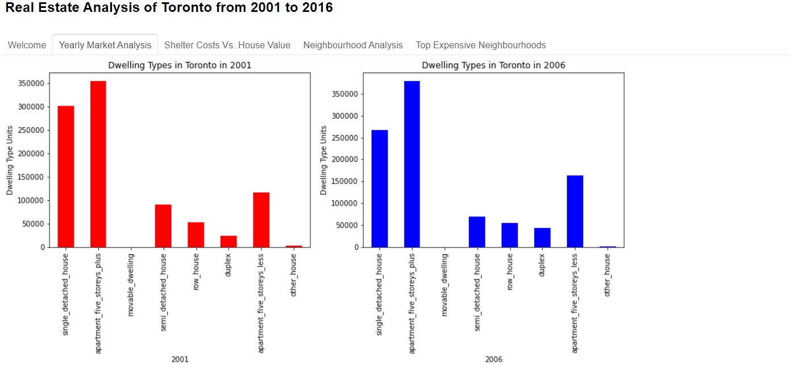

# Toronto Dwellings Analysis Dashboard
This prototype panel dashboard application consists of charts, maps and interactive visualizations that help real estate investment customers to explore the Toronto real estate market data and decide if they want to invest in rental properties in the city. The data analyzed is historical and ranges from 2001 to 2016. The visual analysis includes: house values,  dwelling types per neighbourhood and dwelling costs in Toronto, Ontario.

## Technologies
The technologies required to use this project include: python 3.7 and pandas, load_dotenv and map_box_api, os, panel, pn.extension('plotly'), plotly.express, hvplot.pandas, pathlib, panel.interact. As well as the matplotlib.pyplot function.

## Examples
Census data from 2001 to 2016 is read into a Pandas DataFrame, as well as Toronto neighbourhood coordinates data. The data from the census file is manipulated and prepared for plotting. The line and bar chart plots are created through defined functions for the different types of visualization analysis. The plots are diplayed in a dashboard that contains the following 5 tabs: 
* Welcome
* Yearly Market Analysis
* Shelter Costs Vs. House Value
* Neighbourhood Analysis
* Top Expensive Neighbourhoods. 

Following is information about the different tabs along with some screenshots.

### Welcome 
This tab provides the information mentioned above about the panel dashboard and its purpose. It also shows a mapbox plot that provides a visualization of the average house values in Torronto neighbourhoods over the years from 2001 to 2016. The map is a nice detail that allows users to see where the most expensive houses are located, as well as all other price ranges.

### Yearly Market Analysis 
In this tab, the user can see the dwelling type unit quantities in Toronto in the form of bar charts. There are 4 charts for the 4 years that are covered in the 16 years of census data. This allows the user to analyze the trends of the dwelling types over the years in Toronto.

### Shelter Costs Vs. House Value
The Shelter Costs Vs. House Value tab displays line charts of the average monthly shelter costs for owned dwellings vs. rented dwellings in Toronto over the years. It also shows the average house value in Toronto in the date range being analyzed. We can see that from 2006 onwards, all charts show an increase in shelter costs and house value.

### Neighbourhood Analysis 
This tab is interactive as it allows the user to select a neighbourhood for plotting a line chart of the average house value over the years in the chosen neighbourhood. Similarly, the user can select the neighbourhood for which they would like to see a bar chart of the dwelling type unit quantities for the years 2001, 2006, 2011, and 2016. This permits the user to compare the dwelling type changes over the years, all in one chart.

### Top Expensive Neighbourhoods 
This last tab displays an interactive bar plot of the top 10 most expensive neighbourhoods in Toronto. It shows the average house value for these 10 neighbourhoods. The user can quickly see the neighbourhoods on the x-axis of the plot. They can zoom in, and hover over the bars to get the actual values for the particular neighbourhood.

